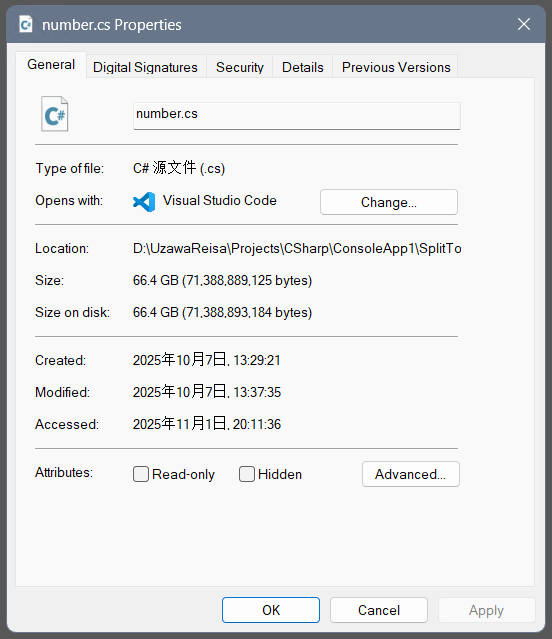
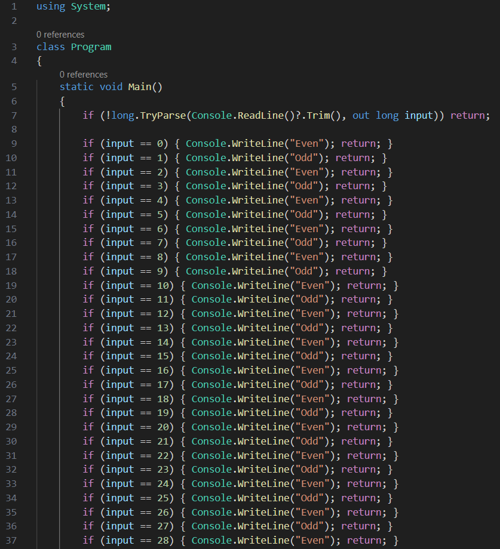
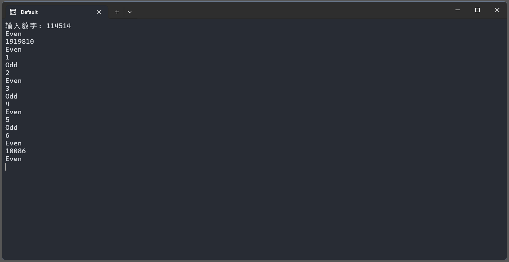

# Number
Project-MethodBox 1024 Shit Mountain Festival

## 这是什么？
这是我在 Project-MethodBox 所举办的 "1024史山节" 活动中题目 "number" 的参赛代码

恭喜此代码在比赛活动中荣获特别奖的好成绩


直播回放：【史山节程序设计比赛成果展逝】 https://www.bilibili.com/video/BV1vcsZzNEeZ

参赛选手代码公开仓库：https://github.com/Project-MethodBox/ShitCode/tree/main

## 原题


## 生成效果（未完全展示）




## 代码解析
### Number
这是生成题目要求代码的程序

灵感来源：【徒儿这样写判断1000以内奇数偶数,气的想吐血】 https://www.bilibili.com/video/BV1wEyCBKEuu

核心原理：通过枚举n从1到1e9的所有情况直接输出结果

编译条件：net8.0-Release-AnyCPU

代码说明：运行生成的产物后会开始生成一个符合C#代码规范的超大代码文件（60GB），其中枚举了可能结果的所有情况

### SplitToChunks
这是用于解决csc无法直接编译超大代码文件的工具，可以将代码分片成多个chunk代码

核心原理：将大文件代码的判断分支分成多个小代码文件

编译条件：net8.0-Release-AnyCPU

代码说明：生成产物在程序目录下的chunks文件夹中，以Chunk_*.cs进行命名，每个分片文件大约50MB大小

### Loader
这是分片文件编译后的dll的反射加载器，用于根据用户输入的数字反射调用对应的dll中的Lookup(long)静态方法获取结果

### build.bat
单线程编译分块文件，通常不采用此方法，编译较慢

### create_build_group.bat
将生成的Chunk_*.cs进行分组编译，加快分片构建速度

## 如何使用本项目
1. 打开本项目slnx文件，编译 Number、SplitToChunks、Loader 这三个项目，并将所编译的源程序找一个文件夹放在一起
2. 打开项目 Number 生成的可执行文件，并等待大约 30min-1h 来生成代码文件，实测大约会生成一个60GB大小的 number.cs 文件
3. 将生成的 number.cs 文件和 SplitToChunks 项目生成的可执行文件放在一起并运行 SplitToChunks 进行分片处理，并等待数十分钟进行代码分片处理，你应该会在程序同目录下的 chunks 文件夹看到如下结构：

```
📁 chunks
├── Chunk_00000.cs
├── Chunk_00001.cs
├── Chunk_00002.cs
├── Chunk_00003.cs
├── ...
```

4. 在所有 chunks_\*.cs 生成完毕后，将 create_build_group.bat 拷贝到与chunks文件夹同一目录下，运行 create_build_group.bat 你应该看到生成了20个 group_\*.bat 文件，如文件树所示。现在你需要全选所有 group_\*.bat 文件右键并以管理员身份运行(确保你的系统已经配置好了csc编译命令)，并等待所有窗口的分片代码构建完成，生成的dll文件在 dlls 目录下，总共大约25GB大小

```
📁 Root
├── 📁 chunks
├── create_build_group.bat
├── group_0.bat
├── group_1.bat
├── group_2.bat
├── group_3.bat
├── group_4.bat
├── group_5.bat
├── ...
```

5. 在所有 group 分组都构建完毕后，你应该注意到 dlls 文件夹中有许多 Chunks_\*.dll 文件，这是分片代码构建的产物用于反射调用，现在你只需要将 Loader 项目编译的源程序文件与 dlls 文件夹放在一起即可使用，如文件树所示。运行 Loader.exe 即可进行测试，如果有任意分片dll文件损坏都有可能导致报错或结果不正确
```
📁 Root
├── 📁 dlls
├── Loader.deps.json
├── Loader.dll
├── Loader.exe
├── Loader.pdb
├── Loader.runtimeconfig.json
├── ...
```

## 程序运行效果


## 特别鸣谢
Project-MethodBox (https://github.com/Project-MethodBox)

Zopiclone-main (https://github.com/Zopiclone-main)

ArabidopsisDev (https://github.com/ArabidopsisDev)
